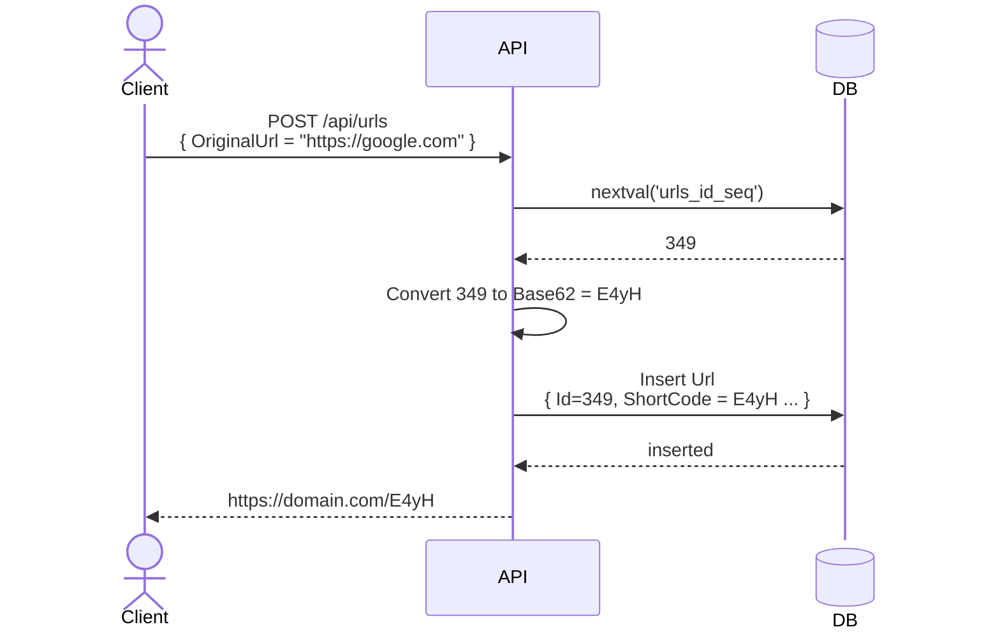

# URL Shortening Process

```mermaid
sequenceDiagram
    actor Client
    participant API
    participant DB@{ "type" : "database" }

    Client->>API: POST /api/urls <br>{ OriginalUrl = "https://google.com" }
    API->>DB: nextval('urls_id_seq')
    DB-->>API: 349
    API->>API: Convert 349 to Base62 = E4yH
    API->>DB: Insert Url <br> { Id=349, ShortCode = E4yH ... }
    DB-->>API: inserted
    API-->>Client: https://domain.com/E4yH
```
